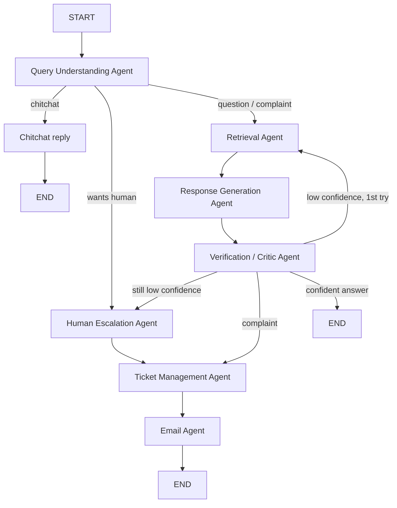

# Enterprise AI Customer Support Agent

Production-ready AI customer support system: Retrieval-Augmented Generation (RAG)
over your company knowledge sources, orchestrated by a **LangGraph multi-agent
workflow**, served by an **async FastAPI** backend.

## Features

- **RAG question answering** with inline source citations on every answer
- **Multi-agent LangGraph workflow**: Query Understanding → Retrieval →
  Generation → Verification (critic) → Escalation / Ticketing / Email agents
- **Conversation memory** persisted per conversation
- **Multi-language**: detects the customer's language and answers in it
- **Human handoff** when the critic's confidence is below threshold or the
  customer asks for a person
- **Automatic ticket creation** for complaints and escalations
- **AI-drafted follow-up emails** (optionally sent via SMTP)
- **Slack** (events webhook + escalation notifications) and **WhatsApp**
  (Twilio webhook + replies) integrations
- **Feedback collection** and **conversation analytics**
- **Admin dashboard** at `/admin` (live metrics + recent tickets)
- **Role-based auth** (admin / agent / customer) with JWT
- Structured JSON logging, rate limiting, typed codebase, Docker, tests

## Architecture

```
app/
├── main.py               # FastAPI app factory, lifespan, middleware
├── core/                 # config, logging, security (JWT/PBKDF2), exceptions
├── db/                   # async SQLAlchemy models + session management
├── schemas/              # Pydantic request/response models
├── services/             # LLM factory, vector store, RAG, memory, tickets,
│                         # email, Slack/WhatsApp, feedback, analytics
├── agents/               # LangGraph state, prompts, nodes, graph, workflow
└── api/                  # DI container, deps (RBAC), middleware, v1 routes
```

### LangGraph workflow



The critic grades groundedness and confidence; below
`CONFIDENCE_THRESHOLD` the workflow first widens retrieval and retries, then
escalates to a human, opens a ticket, notifies Slack, and drafts a follow-up
email.

## Quick start (local)

```bash
python -m venv .venv && . .venv/bin/activate   # Windows: .venv\Scripts\activate
pip install -r requirements.txt
cp .env.example .env                            # set OPENAI_API_KEY etc.
uvicorn app.main:app --reload
```

- Swagger UI: http://localhost:8000/docs
- Admin dashboard: http://localhost:8000/admin (login with `ADMIN_EMAIL` /
  `ADMIN_PASSWORD`)

Seed the sample knowledge base:

```bash
python scripts/seed_kb.py
```

### No API key? Run fully offline

```bash
LLM_PROVIDER=fake EMBEDDING_PROVIDER=fake VECTOR_STORE=memory uvicorn app.main:app
```

The `fake` provider is a deterministic scripted model that exercises the whole
workflow — it is also what the test suite uses.

## Docker

```bash
cp .env.example .env
docker compose up --build
```

With a local Ollama model instead of a cloud provider:

```bash
docker compose --profile ollama up --build
# .env: LLM_PROVIDER=ollama, LLM_MODEL=llama3.2, OLLAMA_BASE_URL=http://ollama:11434,
#       EMBEDDING_PROVIDER=ollama, EMBEDDING_MODEL=nomic-embed-text
```

## Configuration

Everything is environment-driven; see [.env.example](.env.example). Key settings:

| Variable | Purpose | Default |
|---|---|---|
| `LLM_PROVIDER` | `openai` \| `gemini` \| `ollama` \| `fake` | `openai` |
| `EMBEDDING_PROVIDER` | embedding backend | `openai` |
| `VECTOR_STORE` | `chroma` (persistent) \| `memory` | `chroma` |
| `CONFIDENCE_THRESHOLD` | escalate below this critic score | `0.55` |
| `SECRET_KEY` | JWT signing secret (**required in prod**) | — |
| `DATABASE_URL` | any async SQLAlchemy URL | SQLite |

## API overview

Full reference: [docs/API.md](docs/API.md) · ready-to-run requests:
[docs/sample_requests.http](docs/sample_requests.http) · interactive: `/docs`.

| Method | Path | Auth | Description |
|---|---|---|---|
| POST | `/api/v1/chat` | — | Run one support turn (RAG + agents) |
| POST | `/api/v1/feedback` | — | Record a rating for an answer |
| POST | `/api/v1/auth/register` / `login` | — | Account management |
| POST | `/api/v1/knowledge/ingest` | staff | Index documents |
| POST | `/api/v1/knowledge/search` | staff | Raw vector search |
| GET/POST/PATCH | `/api/v1/tickets` | staff | Ticket management |
| GET | `/api/v1/analytics/overview` | staff | Metrics |
| POST | `/api/v1/channels/slack/events` | signature | Slack Events API |
| POST | `/api/v1/channels/whatsapp/webhook` | — | Twilio WhatsApp inbound |

## Testing

```bash
pytest -q
```

Tests run fully offline (fake LLM/embeddings, in-memory vector store, temp
SQLite) and cover auth/RBAC, ingestion, RAG chat with citations, memory,
escalation → ticket → email, feedback, analytics, webhooks, and unit tests for
security and agent helpers.

## Production notes

- Set a strong `SECRET_KEY` and change the bootstrap admin password — startup
  fails in `production` if the default secret is left in place.
- SQLite is fine for a single node; point `DATABASE_URL` at Postgres
  (`postgresql+asyncpg://…`) for scale, and use Alembic for migrations.
- The in-memory rate limiter is per-process; put a gateway or Redis-based
  limiter in front when running multiple replicas.
- Slack requests are verified with the signing secret; keep webhook URLs and
  Twilio credentials in your secret manager.
