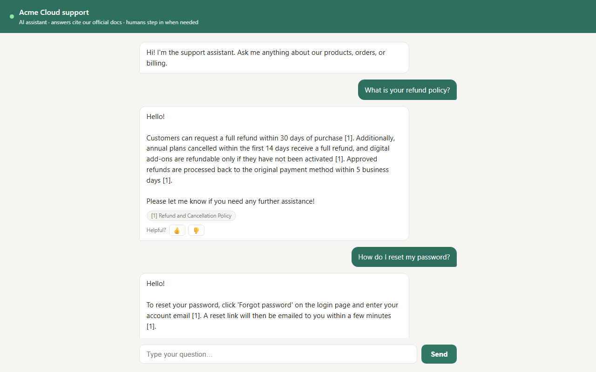
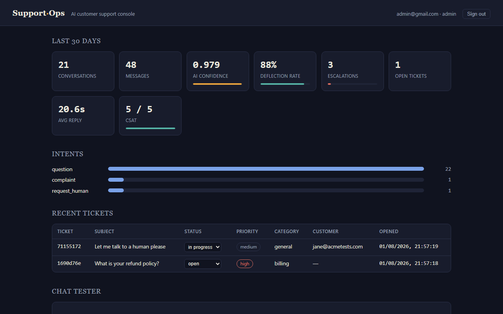
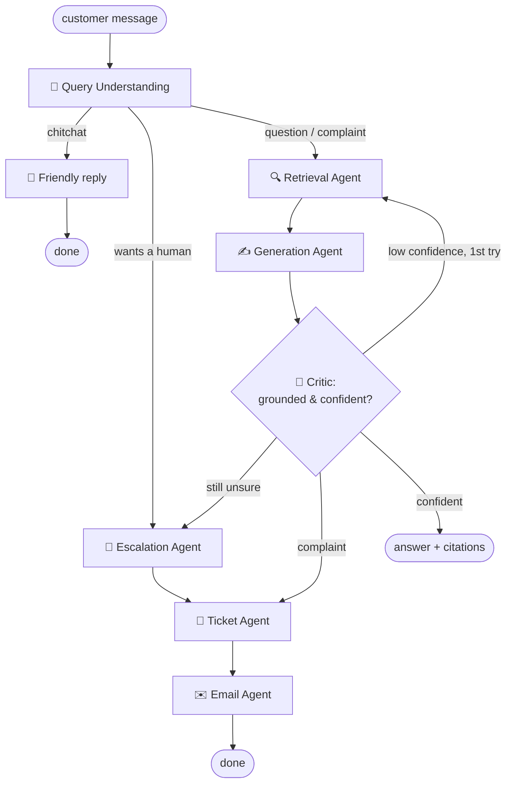

<div align="center">

# 🎧 Enterprise AI Customer Support Agent

**RAG-powered support that cites its sources, knows when it doesn't know,<br>and hands off to humans before it guesses.**

[](https://www.python.org/)
[](https://fastapi.tiangolo.com/)
[](https://langchain-ai.github.io/langgraph/)
[](#-testing)
[](#-docker)

[Quick start](#-quick-start) · [How it works](#-how-it-works) · [API](#-api-overview) · [Configuration](#%EF%B8%8F-configuration) · [Selling guide](docs/SELLING.md)

</div>

---

## 📸 See it in action

<div align="center">

**Customer chat — cited answers with a feedback loop**



<br><br>

**Admin dashboard — deflection rate, confidence, CSAT, and live tickets**



</div>

---

## ✨ What you get

| | Feature |
|---|---|
| 🔍 | **RAG answers with citations** — every reply cites the exact source document `[1]` |
| 🧠 | **Multi-agent LangGraph workflow** — understanding → retrieval → generation → critic → actions |
| 🛟 | **Human handoff** — low critic confidence or "let me talk to a person" escalates automatically |
| 🎫 | **Auto-ticketing** — complaints and escalations open tickets without anyone lifting a finger |
| ✉️ | **AI-drafted follow-up emails** — optionally sent via SMTP |
| 💬 | **Customer chat page + embeddable widget** — one `<script>` tag on any website |
| 📈 | **Admin dashboard** — deflection rate, confidence, CSAT, latency, live tickets at `/admin` |
| 🌍 | **Multi-language** — detects the customer's language and answers in it |
| 📲 | **Slack + WhatsApp** — signed Slack events, Twilio WhatsApp webhook & replies |
| 🔐 | **JWT auth with roles** — admin / agent / customer, PBKDF2 password hashing |
| 🧩 | **Provider-agnostic** — OpenAI, Gemini, Ollama, or a deterministic offline fake |
| ⭐ | **Feedback loop** — 👍/👎 from the chat widget feeds straight into analytics |

---

## 🧭 How it works

The heart of the system is a LangGraph workflow where specialized agents pass a
shared state. The **critic** grades every draft answer for groundedness; below
`CONFIDENCE_THRESHOLD` the workflow widens retrieval and retries, then
escalates to a human, opens a ticket, notifies Slack, and drafts a follow-up
email. **It escalates instead of hallucinating.**



---

## 🚀 Quick start

```bash
python -m venv .venv && . .venv/bin/activate   # Windows: .venv\Scripts\activate
pip install -r requirements.txt
cp .env.example .env                            # add your provider API key
uvicorn app.main:app --reload
python scripts/seed_kb.py                       # load the sample knowledge base
```

| Page | URL |
|---|---|
| 💬 Customer chat | http://localhost:8000/chat |
| 📊 Admin dashboard | http://localhost:8000/admin |
| 📚 Swagger UI | http://localhost:8000/docs |

Embed the chat on any website:

```html
<script src="http://localhost:8000/widget.js"></script>
```

<details>
<summary><b>🔌 No API key? Run fully offline</b></summary>

```bash
LLM_PROVIDER=fake EMBEDDING_PROVIDER=fake VECTOR_STORE=memory uvicorn app.main:app
```

The `fake` provider is a deterministic scripted model that exercises the whole
workflow — it's also what the test suite uses.

</details>

---

## 🐳 Docker

```bash
cp .env.example .env
docker compose up --build
```

<details>
<summary><b>Run with a local Ollama model instead of a cloud provider</b></summary>

```bash
docker compose --profile ollama up --build
```

```ini
# .env
LLM_PROVIDER=ollama
LLM_MODEL=llama3.2
EMBEDDING_PROVIDER=ollama
EMBEDDING_MODEL=nomic-embed-text
OLLAMA_BASE_URL=http://ollama:11434
```

</details>

---

## 🏗️ Architecture

```
app/
├── main.py        # FastAPI app factory, lifespan, middleware
├── core/          # config, logging, security (JWT/PBKDF2), exceptions
├── db/            # async SQLAlchemy models + session management
├── schemas/       # Pydantic request/response models
├── services/      # LLM factory, vector store, RAG, memory, tickets,
│                  # email, Slack/WhatsApp, feedback, analytics
├── agents/        # LangGraph state, prompts, nodes, graph, workflow
└── api/           # DI container, deps (RBAC), middleware, v1 routes
```

Clean architecture: routes → services → data, dependencies injected through a
single container, every boundary typed.

---

## ⚙️ Configuration

Everything is environment-driven — see [.env.example](.env.example).

| Variable | Purpose | Default |
|---|---|---|
| `LLM_PROVIDER` | `openai` · `gemini` · `ollama` · `fake` | `openai` |
| `LLM_MODEL` | main answer model | `gpt-4o-mini` |
| `LLM_FAST_MODEL` | optional smaller model for classification steps | — |
| `EMBEDDING_PROVIDER` | embedding backend | `openai` |
| `VECTOR_STORE` | `chroma` (persistent) · `memory` | `chroma` |
| `CONFIDENCE_THRESHOLD` | escalate below this critic score | `0.55` |
| `COMPANY_NAME` / `BRAND_COLOR` / `CHAT_GREETING` | white-label the chat page & widget | Acme Cloud |
| `SECRET_KEY` | JWT signing secret (**required in prod**) | — |
| `DATABASE_URL` | any async SQLAlchemy URL | SQLite |

---

## 📡 API overview

Full reference: [docs/API.md](docs/API.md) · runnable requests:
[docs/sample_requests.http](docs/sample_requests.http) · interactive: `/docs`

| Method | Path | Auth | Description |
|---|---|---|---|
| `POST` | `/api/v1/chat` | — | Run one support turn (RAG + agents) |
| `POST` | `/api/v1/feedback` | — | Record a rating for an answer |
| `POST` | `/api/v1/auth/register` · `login` | — | Accounts & JWT |
| `POST` | `/api/v1/knowledge/ingest` | staff | Index documents |
| `POST` | `/api/v1/knowledge/search` | staff | Raw vector search |
| `GET/POST/PATCH` | `/api/v1/tickets` | staff | Ticket management |
| `GET` | `/api/v1/analytics/overview` | staff | Metrics |
| `POST` | `/api/v1/channels/slack/events` | signature | Slack Events API |
| `POST` | `/api/v1/channels/whatsapp/webhook` | — | Twilio WhatsApp inbound |

---

## 🧪 Testing

```bash
pytest -q
```

30 tests run **fully offline** (fake LLM/embeddings, in-memory vector store,
temp SQLite): auth/RBAC, ingestion, RAG chat with citations, conversation
memory, escalation → ticket → email, feedback, analytics, webhooks, and unit
tests for security and agent helpers.

---

## 🛡️ Production notes

- Set a strong `SECRET_KEY` and change the bootstrap admin password — startup
  **fails in production** if the default secret is left in place.
- SQLite is fine for a single node; point `DATABASE_URL` at Postgres
  (`postgresql+asyncpg://…`) for scale, with Alembic for migrations.
- The in-memory rate limiter is per-process; use a gateway or Redis-based
  limiter across replicas.
- Slack requests are signature-verified; keep webhook URLs and Twilio
  credentials in a secret manager.
- Selling this to clients? The per-client deployment playbook is in
  [docs/SELLING.md](docs/SELLING.md).

---

<div align="center">
<sub>Built with FastAPI · LangGraph · LangChain · ChromaDB — provider-agnostic by design.</sub>
</div>
